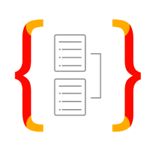

<h2 align="left">Hi 👋! My name is Cayo and I'm a Software Developer from Brazil</h2>

### Main projects

- <a href="https://primeira-fila-api.up.railway.app/docs/" target="_blank">Primeira Fila</a> - An API for movies, cinemas and buying tickets online
- <a href="https://proworking.vercel.app/" target="_blank">Proworking</a> - A website for informal workers
- <a href="https://cayoca.herokuapp.com/api/docs/" target="_blank">Yoca</a> - An API for restaurants management
- <a href="https://jo-king.herokuapp.com/" target="_blank">JoKing</a> - A social network for sharing puns
- <a href="https://portfolio-cayo-rodrigues.vercel.app/" target="_blank">Portfolio</a> - My portfolio webpage
- <a href="https://pypi.org/project/dj-drf-utils/" target="_blank">dj-drf-utils</a> - A Python package that provides useful functions and classes for common tasks in Django projects
- <a href="https://github.com/cayo-rodrigues/gsic" target="_blank">GSiC</a> - This C program accomplishes some common tasks done by grocery stores cashiers

### Main tools and technologies

<table>
  <tr>
    <td align="center" ></td>
    <td align="center"></td>
    <td align="center"></td>
    <td align="center"></td>
    <td align="center"></td>
    <td align="center"></td>
  </tr>
  <tr>
    <td align="center">Python</td>
    <td align="center">Django</td>
    <td align="center">React</td>
    <td align="center">Typescript</td>
    <td align="center">Javascript</td>
    <td align="center">Node.js</td>
  </tr>
  
  <tr>
    <td align="center"></td>
    <td align="center"></td>
    <td align="center"></td>
    <td align="center"></td>
    <td align="center"></td>
    <td align="center"></td>
  </tr>
  <tr>
    <td align="center">Express</td>
    <td align="center">TypeORM</td>
    <td align="center">HTML</td>
    <td align="center">CSS</td>
    <td align="center">C</td>
    <td align="center">PostgreSQL</td>
  </tr>
  
  <tr>
    <td align="center"></td>
    <td align="center"></td>
    <td align="center"></td>
    <td align="center"></td>
    <td align="center"></td>
    <td align="center"></td>
  </tr>
  <tr>
    <td align="center">SQLite</td>
    <td align="center">Redis</td>
    <td align="center">Docker</td>
    <td align="center">AWS S3</td>
    <td align="center">Ubuntu</td>
    <td align="center">Git</td>
  </tr>
</table>

### How to reach me

  
  

##

##

